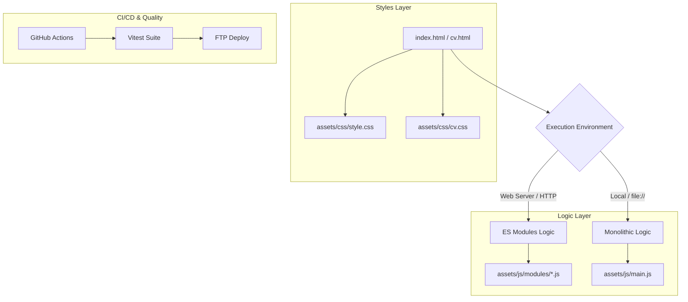

# Portfolio & CV - B. Eng. Felipe de Jesús Miramontes Romero

Official website and interactive CV of Felipe Miramontes. Designed for high performance, accessibility, and visual excellence.

## 🚀 Architecture & Strategy

The project employs a dual-execution strategy to ensure compatibility across different environments (local file system vs. web server).



## 🛠️ Tech Stack

- **Frontend**: HTML5, Vanilla CSS3 (Glassmorphism), JavaScript (ES6+).
- **Icons**: [Simple Icons](https://simpleicons.org/) (via JSDeliver), [FontAwesome 6](https://fontawesome.com/).
- **Testing**: [Vitest](https://vitest.dev/) with JSDOM.
- **CI/CD**: GitHub Actions + FTP Deploy.
- **Tools**: ESLint, Prettier.

## 🧪 Development

### Install Dependencies
```bash
npm install
```

### Run Tests
```bash
npm test
```

### Linting & Formatting
```bash
npm run lint
npm run format
```

## 📄 License
© 2026 Felipe de Jesús Miramontes Romero. All rights reserved.
